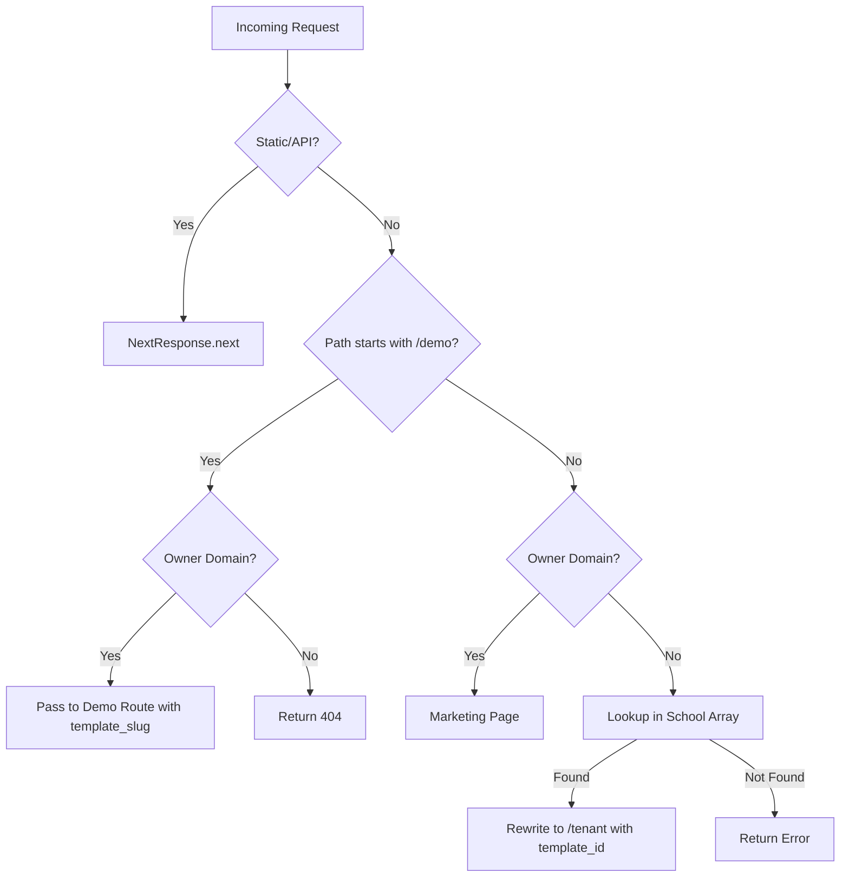

# Design Document: Domain Routing Enhancement

## Overview

This design specifies the implementation of enhanced domain routing logic in the EdDesk Next.js middleware. The enhancement changes the owner domain detection from exact matching to a "contains" check, enabling flexible identification of localhost and eddesk domains regardless of port or subdomain. Additionally, it clarifies the template slug parameter passing mechanism for demo templates versus customer tenants.

### Goals

1. Simplify owner domain detection using substring matching
2. Ensure proper template slug parameter passing for demo and tenant routes
3. Maintain security by restricting demo routes to owner domains only
4. Preserve existing tenant domain lookup functionality

### Non-Goals

1. Migrating from constants.js to Supabase (future enhancement)
2. Changing the tenant route structure (/tenant/[...path])
3. Modifying the marketing page implementation
4. Adding new template types beyond existing ones

## Architecture

### High-Level Flow



### Domain Classification Algorithm

The middleware classifies domains into two categories:

1. **Owner Domains**: Domains containing "localhost" or "eddesk" (case-insensitive)
2. **Tenant Domains**: All other domains

This classification happens before any routing decisions are made.

### Routing Decision Tree

```
1. Is request for static/API resource? → Allow through
2. Is path /demo/*?
   a. Is owner domain? → Allow through (demo route)
   b. Is tenant domain? → Return 404
3. Is owner domain? → Allow through (marketing page)
4. Is tenant domain?
   a. Lookup in school array
   b. Found? → Rewrite to /tenant with template_id
   c. Not found? → Return error
```

## Components and Interfaces

### 1. Domain Classifier

**Purpose**: Determine if a hostname is an owner domain or tenant domain

**Interface**:
```typescript
function isOwnerDomain(hostname: string): boolean
```

**Implementation**:
- Convert hostname to lowercase
- Check if hostname contains "localhost" OR "eddesk"
- Return true if either substring is found, false otherwise

**Example**:
```typescript
isOwnerDomain("localhost:3000")        // true
isOwnerDomain("localhost")             // true
isOwnerDomain("eddesk.in")             // true
isOwnerDomain("www.eddesk.in")         // true
isOwnerDomain("crescentthoothukudi.in") // false
```

### 2. Domain Lookup Service

**Purpose**: Find domain configuration in the school array

**Interface**:
```typescript
interface DomainConfig {
  domain: string;
  template_id: string;
  type: 'owner' | 'tenant';
}

function findDomainConfig(hostname: string): DomainConfig | null
```

**Implementation**:
- Normalize hostname (lowercase, remove www prefix)
- Search domain_data array for exact match on domain field
- Return matching config or null if not found

**Note**: This component maintains backward compatibility with existing lookup logic but is no longer used for owner domain detection.

### 3. Route Handler

**Purpose**: Execute routing decisions based on domain classification and path

**Interface**:
```typescript
function handleRoute(
  request: NextRequest,
  isOwner: boolean,
  config: DomainConfig | null
): NextResponse
```

**Routing Logic**:

1. **Static/API Bypass**: Paths starting with `/_next`, `/api`, or containing `.` pass through unchanged
2. **Demo Route Handling**:
   - Owner domain + /demo/* → Pass through to demo route
   - Tenant domain + /demo/* → Return 404
3. **Owner Domain Handling**: Non-demo paths on owner domains pass through to marketing page
4. **Tenant Domain Handling**: Rewrite to `/tenant/[...path]` with template_id from config

### 4. Template Slug Parameter Handler

**Purpose**: Manage template slug parameters for demo and tenant routes

**Demo Routes**:
- Extract template slug from path (e.g., `/demo/template_classic`)
- Pass as query parameter or path segment to demo handler
- Return error if no template slug specified

**Tenant Routes**:
- Pass `null` or omit template slug parameter
- Tenant system loads template from database using template_id from config

**Implementation Note**: The current middleware uses URL rewriting. Template slug for demos can be extracted from the path pattern `/demo/[template_slug]` and passed via query parameters if needed by the demo route handler.

## Data Models

### DomainConfig

```typescript
interface DomainConfig {
  domain: string;        // Full domain including port (e.g., "localhost:3001")
  template_id: string;   // Template identifier (e.g., "template_classic")
  type: 'owner' | 'tenant'; // Domain classification
}
```

**Source**: `src/lib/constants/constants.js` (domain_data array)

**Usage**:
- Owner domains: `type: 'owner'`, `template_id: ''`
- Tenant domains: `type: 'tenant'`, `template_id: '<template_name>'`

### Request Context

```typescript
interface RequestContext {
  hostname: string;      // Normalized hostname (lowercase, no www)
  originalHost: string;  // Original host header value
  pathname: string;      // Request path
  isOwner: boolean;      // Result of owner domain check
  config: DomainConfig | null; // Matched domain config
}
```

This context is built during middleware execution and used for routing decisions.


## Correctness Properties

*A property is a characteristic or behavior that should hold true across all valid executions of a system—essentially, a formal statement about what the system should do. Properties serve as the bridge between human-readable specifications and machine-verifiable correctness guarantees.*

### Property 1: Owner Domain Classification

*For any* hostname, the middleware should identify it as an owner domain if and only if it contains "localhost" or "eddesk" (case-insensitive), and as a tenant domain otherwise.

**Validates: Requirements 1.1, 1.2, 1.3, 1.4**

### Property 2: Owner Domain Marketing Route

*For any* request from an owner domain with a path that does not start with "/demo", the middleware should allow the request to proceed to the marketing page (NextResponse.next()).

**Validates: Requirements 2.1**

### Property 3: Owner Domain Demo Route Access

*For any* request from an owner domain with a path starting with "/demo", the middleware should allow the request to proceed to the demo route.

**Validates: Requirements 2.2, 6.2**

### Property 4: Tenant Domain Lookup

*For any* request from a tenant domain, the middleware should perform a lookup in the school array to find the domain configuration.

**Validates: Requirements 3.1**

### Property 5: Tenant Domain Rewrite

*For any* tenant domain that exists in the school array, the middleware should rewrite the request to `/tenant/[...path]` with the template_id from the matched configuration.

**Validates: Requirements 3.2, 7.3**

### Property 6: Unknown Domain Error

*For any* tenant domain that does not exist in the school array, the middleware should return an error response.

**Validates: Requirements 3.3**

### Property 7: Demo Template Slug Extraction

*For any* demo route request from an owner domain, the middleware should extract the template slug from the request path or query parameters.

**Validates: Requirements 4.1, 4.2**

### Property 8: Tenant Template Slug Null

*For any* tenant domain request rewritten to `/tenant/[...path]`, the middleware should not pass a template slug parameter (or pass null), allowing the tenant system to load the template from the database.

**Validates: Requirements 5.1**

### Property 9: Demo vs Tenant Classification

*For any* request, the middleware should classify it as a demo request if the path starts with "/demo" and it's from an owner domain, otherwise classify it as a tenant request if it's from a tenant domain.

**Validates: Requirements 5.2, 5.3**

### Property 10: Tenant Demo Access Blocked

*For any* request from a tenant domain with a path starting with "/demo", the middleware should return a 404 Not Found response.

**Validates: Requirements 6.1**

### Property 11: Demo Access Logging

*For any* blocked demo access attempt from a tenant domain, the middleware should create a log entry.

**Validates: Requirements 6.3**

### Property 12: Domain Field Matching

*For any* domain lookup, the middleware should match against the "domain" field in the school array entries.

**Validates: Requirements 7.2**

### Property 13: WWW Prefix Normalization

*For any* hostname with or without a "www." prefix, the middleware should match the same domain configuration in the school array.

**Validates: Requirements 7.4**

## Error Handling

### Unknown Domain Handling

**Scenario**: Request from a tenant domain not in the school array

**Response**:
- Return HTTP 500 or custom error page
- Log the unknown domain for monitoring
- Include helpful error message for debugging

**Implementation**:
```typescript
if (!config && !isOwner) {
  console.error(`[Middleware] Unknown domain: ${hostname}`);
  return new NextResponse('Domain not configured', { status: 500 });
}
```

### Demo Route Access Violation

**Scenario**: Tenant domain attempts to access /demo/* route

**Response**:
- Return HTTP 404 Not Found
- Log the blocked attempt with domain and path
- Do not reveal that demo routes exist

**Implementation**:
```typescript
if (pathname.startsWith('/demo') && !isOwner) {
  console.warn(`[Middleware] Demo access blocked: ${hostname} -> ${pathname}`);
  return new NextResponse('Not Found', { status: 404 });
}
```

### Missing Template Slug in Demo Route

**Scenario**: Demo route accessed without template slug parameter

**Response**:
- Return HTTP 400 Bad Request
- Include error message indicating missing template slug
- Log the invalid request

**Implementation**:
```typescript
if (pathname === '/demo' || pathname === '/demo/') {
  console.error(`[Middleware] Demo route missing template slug: ${pathname}`);
  return new NextResponse('Template slug required', { status: 400 });
}
```

### Static Resource Handling

**Scenario**: Request for static files, API routes, or Next.js internals

**Response**:
- Bypass all routing logic immediately
- Allow Next.js to handle the request normally
- No logging required for these requests

**Implementation**:
```typescript
if (pathname.startsWith('/_next') || 
    pathname.startsWith('/api') || 
    pathname.includes('.')) {
  return NextResponse.next();
}
```

## Testing Strategy

### Overview

The domain routing enhancement will be validated using a dual testing approach:

1. **Unit Tests**: Verify specific examples, edge cases, and error conditions
2. **Property-Based Tests**: Verify universal properties across all inputs

Both testing approaches are complementary and necessary for comprehensive coverage. Unit tests catch concrete bugs in specific scenarios, while property tests verify general correctness across a wide range of inputs.

### Property-Based Testing

**Framework**: We will use **fast-check** for TypeScript/JavaScript property-based testing.

**Configuration**:
- Each property test will run a minimum of 100 iterations
- Tests will use random input generation to cover edge cases
- Each test will reference its corresponding design property

**Test Tagging Format**:
```typescript
// Feature: domain-routing-enhancement, Property 1: Owner Domain Classification
```

**Property Test Examples**:

```typescript
import fc from 'fast-check';

// Feature: domain-routing-enhancement, Property 1: Owner Domain Classification
test('owner domain classification', () => {
  fc.assert(
    fc.property(fc.string(), (hostname) => {
      const isOwner = isOwnerDomain(hostname);
      const containsLocalhost = hostname.toLowerCase().includes('localhost');
      const containsEddesk = hostname.toLowerCase().includes('eddesk');
      
      expect(isOwner).toBe(containsLocalhost || containsEddesk);
    }),
    { numRuns: 100 }
  );
});

// Feature: domain-routing-enhancement, Property 13: WWW Prefix Normalization
test('www prefix normalization', () => {
  fc.assert(
    fc.property(
      fc.record({
        domain: fc.webUrl(),
        template_id: fc.string(),
        type: fc.constantFrom('owner', 'tenant')
      }),
      (config) => {
        const withWww = `www.${config.domain}`;
        const withoutWww = config.domain;
        
        const result1 = findDomainConfig(withWww);
        const result2 = findDomainConfig(withoutWww);
        
        // Both should match the same config or both should be null
        expect(result1?.domain).toBe(result2?.domain);
      }
    ),
    { numRuns: 100 }
  );
});
```

### Unit Testing

**Framework**: Jest with Next.js testing utilities

**Focus Areas**:
1. Specific domain examples (localhost:3000, eddesk.in, crescentthoothukudi.in)
2. Edge cases (empty hostname, malformed URLs, special characters)
3. Integration between middleware and Next.js routing
4. Error response formats and status codes

**Unit Test Examples**:

```typescript
describe('Middleware Domain Routing', () => {
  test('localhost:3000 routes to marketing page', () => {
    const request = createMockRequest('localhost:3000', '/');
    const response = middleware(request);
    expect(response.status).toBe(200);
    expect(response.headers.get('x-middleware-rewrite')).toBeNull();
  });

  test('tenant domain not in school array returns error', () => {
    const request = createMockRequest('unknown-school.com', '/');
    const response = middleware(request);
    expect(response.status).toBe(500);
    expect(response.statusText).toContain('not configured');
  });

  test('demo route on tenant domain returns 404', () => {
    const request = createMockRequest('crescentthoothukudi.in', '/demo/template_classic');
    const response = middleware(request);
    expect(response.status).toBe(404);
  });

  test('static files bypass routing logic', () => {
    const request = createMockRequest('localhost:3000', '/_next/static/chunk.js');
    const response = middleware(request);
    expect(response.status).toBe(200);
  });
});
```

### Test Coverage Goals

- **Line Coverage**: Minimum 90% for middleware.ts
- **Branch Coverage**: Minimum 85% for all routing decision branches
- **Property Coverage**: 100% of design properties must have corresponding property tests
- **Edge Case Coverage**: All error conditions must have unit tests

### Testing Workflow

1. **Development**: Write unit tests for specific scenarios as code is written
2. **Property Tests**: Implement property tests after core logic is complete
3. **Integration**: Run both test suites in CI/CD pipeline
4. **Regression**: Maintain all tests as codebase evolves

### Manual Testing Checklist

Before deployment, manually verify:
- [ ] localhost:3000 shows marketing page
- [ ] localhost:3000/demo/template_classic shows demo template
- [ ] localhost:3001 shows tenant site with template_classic
- [ ] crescentthoothukudi.in shows tenant site with template_modern
- [ ] crescentthoothukudi.in/demo/template_classic returns 404
- [ ] unknown-domain.com returns error page
- [ ] Static files and API routes work on all domains

## Implementation Notes

### Migration Strategy

The implementation will modify the existing `src/middleware.ts` file with the following changes:

1. **Extract Owner Domain Check**: Create `isOwnerDomain()` helper function
2. **Simplify Routing Logic**: Remove dependency on `config.type` for owner domain detection
3. **Preserve Backward Compatibility**: Maintain existing tenant lookup logic
4. **Add Error Handling**: Implement proper error responses for edge cases

### Code Organization

```
src/
├── middleware.ts              # Main middleware with routing logic
├── lib/
│   ├── constants/
│   │   └── constants.js      # Domain data (unchanged)
│   └── middleware/
│       ├── domain-classifier.ts    # isOwnerDomain() helper
│       ├── domain-lookup.ts        # findDomainConfig() helper
│       └── route-handler.ts        # Routing decision logic
```

### Performance Considerations

- **Owner Domain Check**: O(1) string contains operation
- **Domain Lookup**: O(n) linear search through domain_data array
- **Caching**: Consider caching domain lookups if array grows large
- **Edge Runtime**: Middleware runs on Edge, keep bundle size minimal

### Future Enhancements

1. **Supabase Migration**: Replace constants.js with database lookup
2. **Caching Layer**: Add Redis/KV cache for domain configurations
3. **Wildcard Domains**: Support subdomain wildcards (*.school.com)
4. **Custom Error Pages**: Branded error pages for unknown domains
5. **Analytics**: Track domain routing metrics and errors

## Security Considerations

### Demo Route Protection

Demo routes must only be accessible from owner domains to prevent:
- Unauthorized access to template previews
- Exposure of template implementation details
- Potential abuse of demo functionality

**Mitigation**: Strict path checking and 404 responses for tenant domain access attempts.

### Domain Spoofing

Malicious actors could attempt to spoof owner domains through:
- Host header manipulation
- DNS poisoning
- Subdomain takeover

**Mitigation**: 
- Use Next.js built-in host header validation
- Implement rate limiting for unknown domains
- Monitor logs for suspicious domain patterns

### Information Disclosure

Error messages should not reveal:
- Internal system structure
- Available templates or domains
- Routing logic details

**Mitigation**: Generic error messages for external users, detailed logging for internal monitoring.

### Input Validation

All hostname inputs must be validated to prevent:
- Path traversal attacks
- Header injection
- XSS through reflected hostnames

**Mitigation**: Use Next.js sanitized request objects, avoid reflecting raw hostnames in responses.
